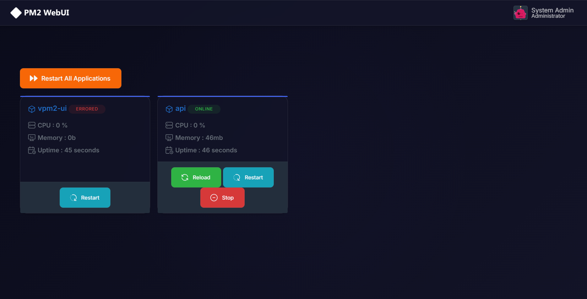
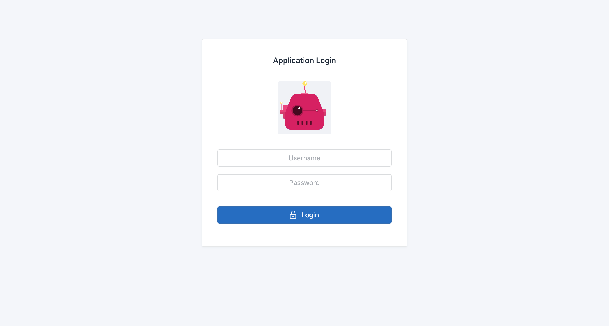
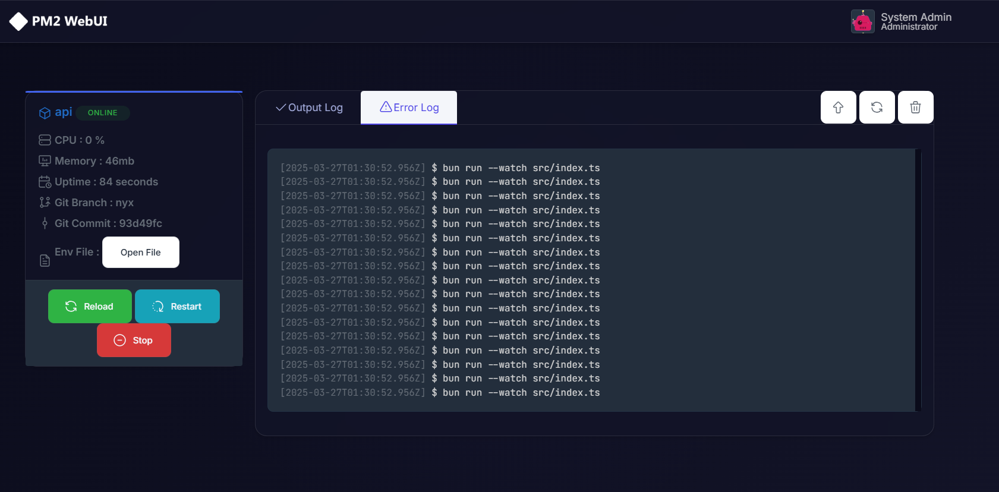

# vPM2 UI

<div align="center">
  
  <p><em>A modern, secure, and feature-rich web interface for PM2 process manager</em></p>
</div>

## 🌟 Features

### Core Features

- 🔒 Secure Authentication System
- 📊 Real-time Process Monitoring
- 📝 Advanced Log Management
- 🎨 Modern, Responsive UI
- 🔄 Zero-downtime Deployments
- 🌐 GitHub Webhook Integration
- ⚙️ Environment Variable Management

### Process Management

- Start/Stop/Restart Applications
- Monitor CPU & Memory Usage
- View Real-time Logs
- Process Scaling
- Error Tracking

### Deployment Features

- Manual & Automated Deployments
- GitHub Integration
- Deployment History
- Rollback Capability
- Environment Management

## 🚀 Quick Start

### Prerequisites

- Node.js 16+ or Bun
- PM2 installed globally (`npm install -g pm2`)

### Installation

```bash
# Clone the repository
git clone https://github.com/yourusername/vpm2-ui.git
cd vpm2-ui

# Install dependencies
bun install

# Copy environment file
cp env.example .env

# Setup admin user
bun run setup-admin-user

# Start the application
bun start
```

### Development Mode

```bash
bun run start:dev
```

## ⚙️ Configuration

The application can be configured through environment variables. See [env.example](env.example) for all available options.

## 🔒 Security Features

- Rate Limiting
- Session Management
- Secure Password Hashing
- CSRF Protection
- XSS Prevention

## 📸 Screenshots

<div align="center">
  
  
</div>

## 🛠️ Built With

- [Koa.js](https://koajs.com/) - Web framework
- [PM2](https://pm2.keymetrics.io/) - Process Manager
- [Bun](https://bun.sh/) - JavaScript Runtime & Package Manager
- [shadcn/ui](https://ui.shadcn.com/) - UI Components

## 🤝 Contributing

Contributions are welcome! Please feel free to submit a Pull Request.

1. Fork the repository
2. Create your feature branch (`git checkout -b feature/AmazingFeature`)
3. Commit your changes (`git commit -m 'Add some AmazingFeature'`)
4. Push to the branch (`git push origin feature/AmazingFeature`)
5. Open a Pull Request

## 📝 License

This project is licensed under the MIT License - see the [LICENSE](LICENSE) file for details.

## 🙏 Acknowledgments

- [PM2](https://pm2.keymetrics.io/) - The amazing process manager
- All contributors who have helped shape this project

## 📞 Support

If you encounter any issues or have questions, please open an issue in the GitHub repository.
